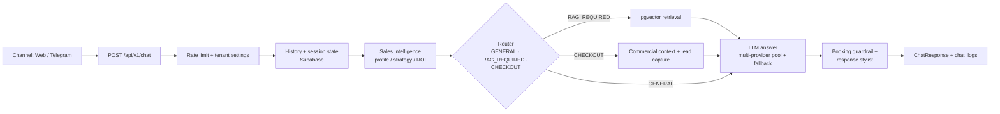

# Dami Works — AI Sales & Support Agent Platform

Production monorepo for **Dami Works**, an AI-automation product that deploys "AI employees" to
handle inbound leads, qualification, follow-ups, live product demos, and human hand-off across the
web and messengers.

A single **channel-agnostic FastAPI backend** powers a Next.js marketing site and a Telegram adapter
bot. The system is multi-tenant: the same engine runs a B2B sales consultant and interactive vertical
demos (English school, medical center, and a custom roleplay where a prospect uploads their own
documents and talks to an agent trained on them).

> **Stack:** Python 3.11 · FastAPI · Google Gemini / Anthropic Claude / OpenAI · Supabase (Postgres + pgvector) · Next.js 15 / React 19 / TypeScript · aiogram 3 · Docker · Caddy · Vercel

---

## Why this project is interesting (engineering highlights)

- **Deterministic router as the system's dome.** Every message is classified into `GENERAL`,
  `RAG_REQUIRED`, or `CHECKOUT` before any generation. The LLM cannot bypass the router to invent
  prices or jump a prospect to checkout — commercial intent is verified separately.
- **Multi-provider LLM layer with cross-provider fallback.** Each task profile (`router`,
  `sales_writer`, `rag_writer`, `medical_planner`, …) has its own ordered pool of `provider:model`
  refs. A request walks the pool with per-entry timeouts, retries, and cooldowns under a shared 55s
  budget, falling over from Gemini → Claude → OpenAI when a provider degrades. Per-request token/cost
  is tracked.
- **Anti-hallucination booking guardrail.** For scheduling, the model may *only* speak slots supplied
  by a deterministic, timezone-aware slot engine. Invented dates/times are replaced with a safe
  "I'll confirm and get back to you" answer. The clinic profile (hours, specialties, doctors) is
  parsed entirely from the tenant's knowledge base — nothing is hardcoded, so swapping the KB
  rebuilds the whole booking domain.
- **Adaptive Sales Intelligence layer.** Instead of a rigid questionnaire, a `sales_intelligence`
  package (shadow profiler, signal analyzer, scoring, strategy engine, ROI engine, question budget,
  wow router) decides conversation depth, the next best action, and when to close — per client.
- **RAG over Supabase pgvector** for grounded answers about services, integrations, and capabilities.
- **Human-style response shaping.** A deterministic stylist splits the final answer into 1–3
  messenger bubbles (never dropping content) and reduces it to exactly one question.
- **Offline quality harness.** A weekly LLM-as-judge batch scores 100% of the week's real dialogs on
  a rubric (naturalness, pain discovery, funnel progression, RAG factual accuracy, guardrail
  compliance) into an `eval_runs` table — no sampling.
- **39-test pytest suite**, including phase-by-phase sales-intelligence tests and an end-to-end
  booking flow.

---

## Request pipeline



---

## Repository structure

```
plum-dev/
├── damiworks-ai-service/     # FastAPI backend — the core AI service (all /api/v1 routes)
│   ├── app/
│   │   ├── api.py                 # HTTP router: chat, lead, contact, feedback, doc upload
│   │   ├── gemini_service.py      # Prompt assembly, route classification, generation
│   │   ├── llm_providers.py       # provider:model abstraction + cross-provider fallback
│   │   ├── sales_intelligence/    # Adaptive sales layer (profiler, scoring, ROI, strategy…)
│   │   ├── booking_provider.py    # Soft-hold → confirm booking with race protection
│   │   ├── slot_engine.py         # Deterministic, timezone-aware slot generation
│   │   ├── clinic_profile.py      # Clinic domain parsed from KB (nothing hardcoded)
│   │   ├── quality_eval.py        # Offline LLM-judge rubric
│   │   └── medical_center_* / english_school_*  # Vertical demo pipelines
│   ├── tests/                     # 39 pytest tests incl. e2e booking + sales phases
│   ├── scripts/                   # Deploy, RAG indexing, weekly quality eval, cost report
│   └── sql/                       # Supabase schema + migrations
├── damiworks-site/           # Next.js 15 + React 19 site, web chat, quality console
├── damiworks_tg_bot/         # aiogram 3 Telegram adapter (no business logic)
└── docs/                     # Architecture & spec documents
```

---

## Quick start (AI service)

```bash
cd damiworks-ai-service
python -m venv .venv
# Windows:  .venv/Scripts/python.exe -m pip install -r requirements.txt
# Linux/Mac: source .venv/bin/activate && pip install -r requirements.txt
cp .env.example .env          # set GEMINI_API_KEY, SUPABASE_URL, SUPABASE_SERVICE_ROLE_KEY
uvicorn app.main:app --host 127.0.0.1 --port 8010 --reload
```

Health check: `curl http://localhost:8010/health` → `{"status":"ok"}`
Run tests: `pytest` (from `damiworks-ai-service/`)

The Next.js site (`damiworks-site/`) proxies to the backend; the Telegram bot (`damiworks_tg_bot/`)
is a thin adapter. See [`AGENTS.md`](AGENTS.md) for the full run/test guide of every component and
[`docs/`](docs/) for architecture notes.

---

## Tech stack

| Concern | Technologies |
|---|---|
| Backend | Python 3.11, FastAPI, Uvicorn, Pydantic |
| LLM / embeddings | Google Gemini, Anthropic Claude, OpenAI (unified provider layer) |
| Retrieval / state | Supabase (PostgreSQL + pgvector) |
| Frontend | Next.js 15, React 19, TypeScript 5, Tailwind CSS |
| Messaging | aiogram 3 (Telegram) |
| Testing | pytest, tsx |
| Deployment | Docker, Docker Compose, Caddy (VPS), Vercel |
